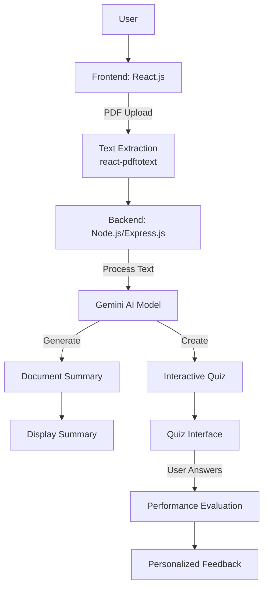
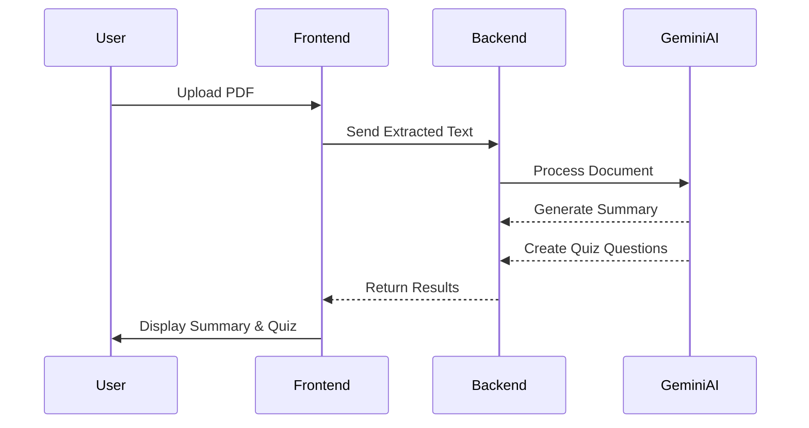
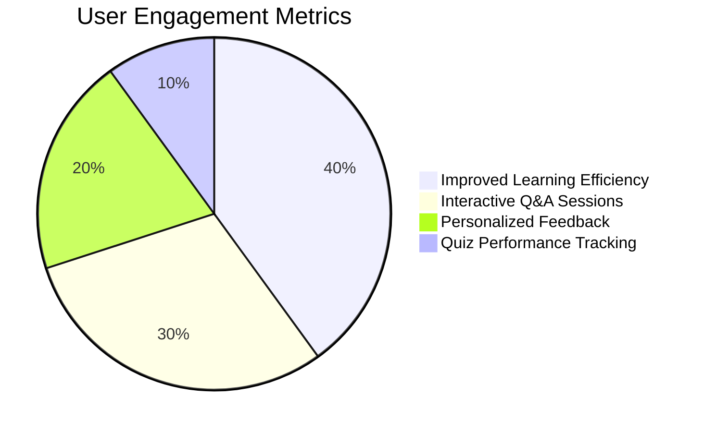

# 📚 TeachMe: AI-Powered Learning Assistant

## 🌟 Project Overview

TeachMe is an innovative web application that leverages AI to transform how students interact with academic content. Developed by students from Manikya Lal Verma Textile & Engineering College, this project aims to simplify learning through intelligent document processing and knowledge assessment.

## 🎯 Problem Statement

Addressing the challenges students face when studying large volumes of text by creating an AI-driven platform that:
- Summarizes academic content
- Enables intelligent Q&A interactions
- Provides knowledge evaluation through quizzes

## 📊 System Architecture



## ✨ Key Features

- 📄 PDF Document Processing
- 🤖 AI-Powered Summarization
- ❓ Intelligent Q&A Interface
- 🧠 Dynamic Quiz Generation
- 📊 Personalized Performance Feedback

## 🛠 Technologies Stack

### Frontend
- React.js
- Tailwind CSS
- react-pdftotext
- MARKDOWNRENDER library

### Backend
- Node.js
- Express.js

### AI Integration
- Gemini Large Language Model (LLM)

## 🔧 Component Interaction



## 🚀 Development Journey

### Challenges Overcome
1. Complex PDF Text Extraction
2. AI Response Formatting
3. Dynamic Quiz Generation

### Strategy
1. Requirement Analysis
2. Technology Selection
3. Modular Development
4. Continuous Testing and Optimization

## 🔍 Performance Metrics



## 👥 Team

- Ankit Sharma (CSE, 2nd Year)
- Aditya Maheshwari (CSE, 2nd Year)
- Kishori Arora (CSE, 2nd Year)

## 📦 Installation

### Prerequisites
- Node.js
- npm

### Steps
1. Clone the repository
   ```bash
   git clone https://github.com/your-username/teachme.git
   ```
2. Install dependencies
   ```bash
   cd teachme
   npm install
   ```
3. Start the application
   ```bash
   npm start
   ```

## 🔒 License
This project is part of CreateX 2024 innovation challenge.

## 🌈 Future Roadmap
- Multi-language Support
- Enhanced AI Models
- More Sophisticated Quiz Algorithms
- User Performance Analytics
